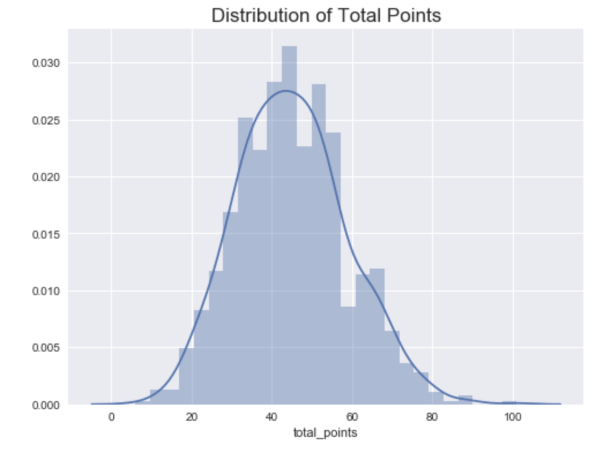
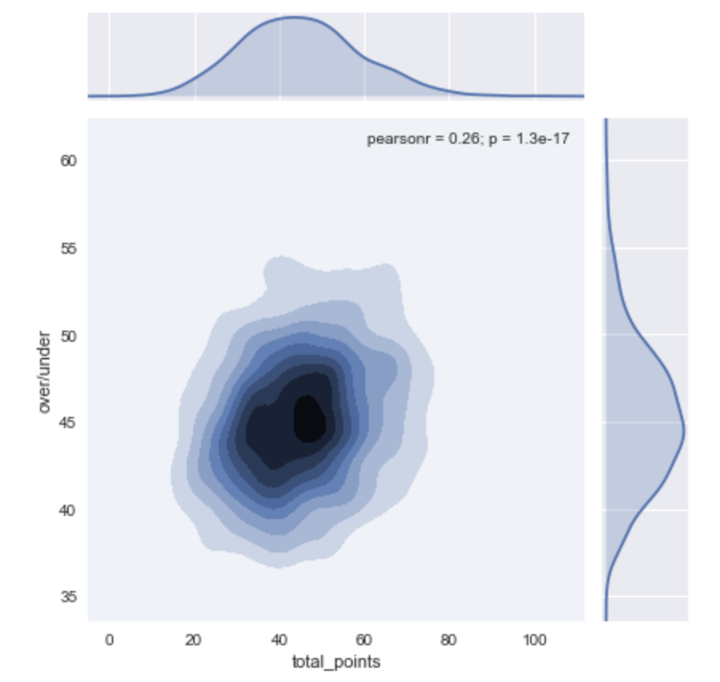
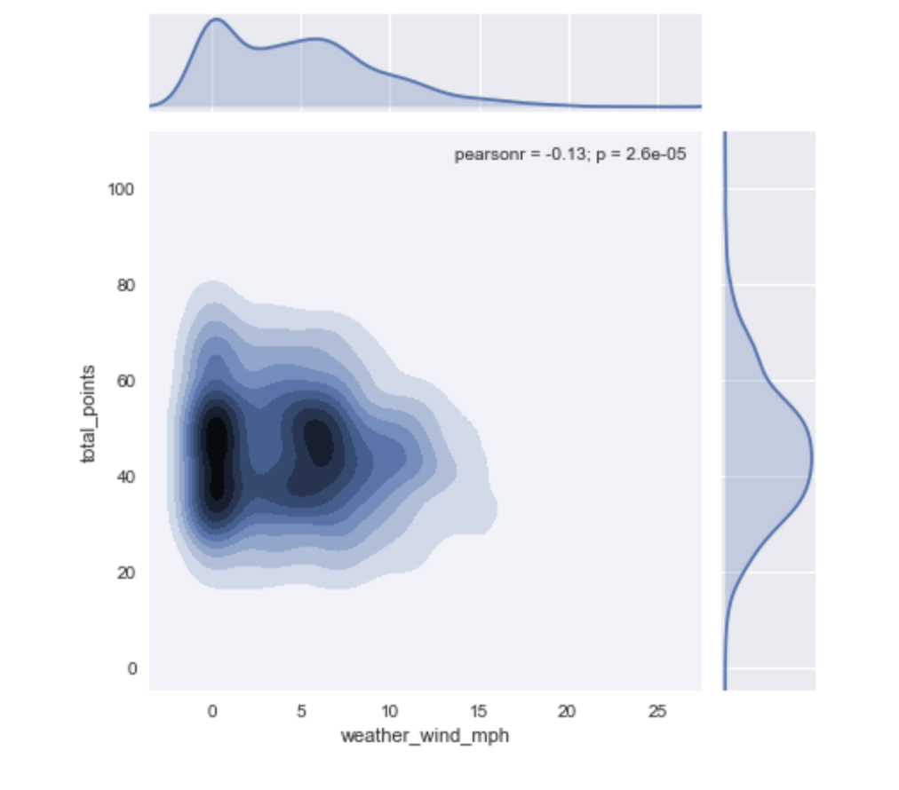

# Technical Report - Predicting Over/Under Outcomes for NFL Games

### EXECUTIVE SUMMARY

Sports gambling has become very popular in today’s society, even more so with the legalization of sports gambling in  a few states. There are now dedicated TV, radio, and podcasts dedicated to betting on sports. Sports bettors are trying to do everything they can to beat the odds makers. With the surplus of data available, being able to find trends and any statistical advantage can make all the difference when placing a bet. This betting model developed is going to attempt to assess the current potential of a NFL team, which is then compared to its opposition in an attempt to gauge the likely outcome of the contest. This will be accomplished by building a classification model with all the NFL teams, odds, spreads, and outcomes since the 2014 to the 2018 season. This model will then help provide insights to sports bettors on whether teams are more likely to go over or under the set betting line. In order to make this classification model we will creatively handle missing data and null values and see what factors make the biggest difference when predicting the outcome of a NFL game.

### PROBLEM STATEMENT
Is it possible to find value in the NFL betting markets and provide insights to bettors to beat the sports handicappers?

### GATHERING/CLEANING DATA
There is an abundance amount of data for the NFL however, this does make the process any easier. The one nice thing is most the data is easily accessible. With so much data available trying to narrow it down to what is going to be the most effective and efficient type of data for predicting can be difficult. To not overwhelm my model with an abundance of non-useful data, had to narrow it down to two different data sources. One containing NFL matchups, scores, and weather data and the second containing all the odds, spreads, and lines for from 09/07/2006 to 02/04/2018. Using two different web sources I was able to attain and download all the necessary NFL statistics and convert it into two separate csv files. 

First looked into trying to find missing and obscure values within both data sets, most of the data is either an integer or a float. Once inspecting the initial data download, noticed there are many null and missing values that will need to be looked at in more detail. There are 4 columns that needed to be dropped from the odds dataframe. There are two columns that have zero meaning once looked at closely, notes and neutral venue, these are dropped from the odds dataframe. Next dropping columns from the odds dataframe that appear in both dataframes. 

After examining the odds dataframe there are approximately 2,500 null values for the odds and lines that will need to be dealt with. The reason for this is oddsmakers really didn’t start keeping betting track of of past odds/lines since recently starting in 2014. The first initial thought is to drop all years before 2014 as there would be enough data still present. Want to look into different ways to handle all of the null values first before taking this step. The biggest obstacle is most of these lines would have to be found throughout different web sources and may not be reliable. And manually inputting all these values would be a waste of time and may not actually help in the grand scheme of things. I inspected the home odds/lines and away odds/lines open looking into the variance between games and if there are any obscure outliers. The findings were that most of the odds to win for both home and away are between 0 and 4. For this I concluded that filling in the the odds/lines close with the mean odds value for that game would be the best option compared to using a min/max/mode. In the sports gambling once the odds/lines are set, they do not shift much. At most odds/lines will shift by 0.5 up or down depending on where the money is going. 

The both the odds and the spread dataframe have a date column next to each matchup. Converted this column into a time series as this is beneficial when looking into points scored. Throughout the years the NFL has been becoming a more pass heavy league, this leads to more points scored. Based off what NFL season year it is, can play a huge role in how many points are scored. By doing this both data frames are sorted by date then home team alphabetically. Now when merging both data sets each game will match up accordingly to the date.

Once merged went back into looking into the null values that have previously been filled in. Came to the conclusion that dropping all columns before the 2014 season would be the most efficient and beneficial, as there are still 5 NFL seasons(years) of data to be used. With more time, what would be the best option is to find alternative data sources that could be trusted and reliable to fill in the null values. Furthermore, since these values are not just missing at random, they were not accounted for until recently. Doesn’t make sense to fill them in  since they technically do not exist.

### EDA
At first glance of the plotted histograms for all numerical features it is hard to tell at this point which features will be of most importance. Feature engineering is going to be key in understanding what closely relates to the over/under lines.
First creating a new over/under result column for each game is essential to help get a target column for the game predictions. This column will show if the result of the game was over, under, or a push on the expected total points. 
Before going into EDA I had some intuition that weather is going to be a factor when it comes to predicting if a certain game is going to go over/under the set lines. When it comes to points scored one can infer that what type of weather is occurring during the time of the game can have an impact on the score. When a game is played in a dome an not an outdoor stadium, it eliminates all the effects of weather, ie more points are scored in a dome. No wind, rain, snow, or extreme temperatures which can affect player performance, which in turn can decrease total points. To account for this created a dummy variable column for all stadium types and weather, dome, non-dome, rain, snow, fog and combinations of those if present.
I made a average win rate column this will be used to determine who has the better record in each matchup and can be used to determine how many points will be scored.  Also made a cumulative average total points column. The histogram below shows the most frequent total points for each game, the average being around 45 total points per game. This follows a pretty normal distribution. This a good depiction of having enough sufficient data as the NFL game average is actually 43 total points.

The creation of the cumulative avg points column will be a key predictor in predicting the over/under as most NFL games do a follow a scoring pattern.
Next examined how closely vegas set over/under is to the actual total points. The visual below shows a very saturated point of interest on 45 points. This conveys how accurate the set over/under is for each game versus total points scored, which shows the difficulty behind predicting if the total points will be over/under. 

Lastly, analyzed the effect of high winds on points scored. When there is high wind in an NFL game it makes it harder to make accurate passes. On the graph below there is a slight downward trend when there is high wind, however there are not as many high wind games within the data to portray a conclusive accurate depiction.

### MODELING

### CONCLUSION

### NEXT STEPS

